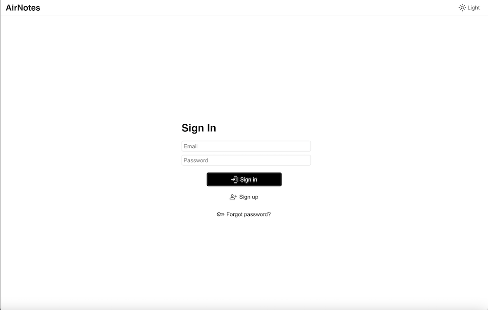

# AirNotes - a note-taking web app

The frontend of a basic note taking app inspired by Notion. There are still bugs regarding the UI and features so this 
web app should not be used in production. Sample screenshots are included below.




## Requirement
* React
* Vite
* Firebase
* Tiptap

## Usage
Clone the repository

```angular2html
git clone https://github.com/dashluu/AirNotes-web.git
```

Go to the project directory and run

```
// To install packages
npm install
// To run the web app
npm run dev
```

Open http://localhost:5173 to see the web app!

## Features
- [x] Basic editor with different types of lists, headings, formatting styles, and text alignment
- [x] Add images via links, drag and drop, and uploading
- [x] Summarizing the document using LLM
- [x] Answer questions from the document using LLM
- [x] Search all documents semantically using vector search and LLM
- [x] Generate images with Stable Diffusion(slow)

## Known issues
* Streaming response is not working for Safari
* UI is not great for small-screen devices
* Some UI elements do not animate smoothly
* Untested email and password reset
* Pagination might work incorrectly if the data is updated(removed or inserted) continuously
* Search is still limited, especially home page search


